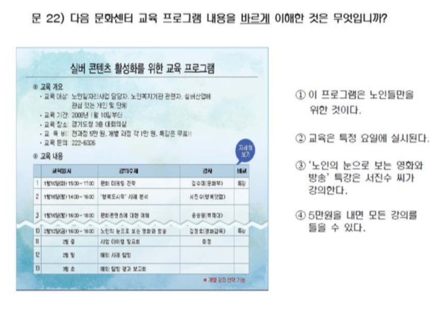

<!--
#### Data 
-->

<!--#### Excel 자료 읽어들이기 

* excel 파일을 잘 읽어들이는 `xlsx` 패키지를 올려놓고, 자료구조에 맞춰 argument 설정.
    * Sheet 번호, startRow, colIndex, header 의 용도 파악. 
-->

```{r setup, include=FALSE}
knitr::opts_chunk$set(echo = TRUE)
library(xlsx)
library(pander)
library(knitr)
library(magrittr)
panderOptions('table.split.table', Inf)
panderOptions('table.alignment.rownames', 'left')
panderOptions('table.alignment.default', 'right')
options(width=180)
# panderOptions('digits', 3)
```


```{r, read data, echo = FALSE, results = 'hide'}
# load("./red_and_black_190830_data.RData")
literacy_roll <- read.xlsx("../data/literacy_1902.xlsx", 
                           sheetIndex = 1, 
                           startRow = 1, 
                           endRow  = 69, 
                           colIndex = c(3, 6:30), 
                           colClasses = c(rep("character", 26)), 
                           header = TRUE, 
                           stringsAsFactors = FALSE,
                           encoding = "UTF-8")
names(literacy_roll) <- c("id", paste0("Q", 1:25))
head(literacy_roll$id)
str(literacy_roll)
## literacy_roll 에 그룹을 짝지어 추가 (예시이나 재현하려면 set.seed 사용하여야 함)
set.seed(2)
literacy_roll$group <- literacy_roll %>%
  nrow %>%
  `:`(1, .) %>%
  sample %>%
  `%%`(2) %>%
#  sample(1:nrow(literacy_roll)) %% 2 %>%
  factor(levels = 0:1, labels = c("Red", "Black"))
# literacy_roll$group <- class_roll$group[match(literacy_roll$id, class_roll$id)]
# literacy_roll$id %in% class_roll$id
literacy_roll[-c(1, 27)] %>%
  sapply(table)
literacy_roll[2:26] %<>% 
  sapply(FUN = {. %>% substr(start = 1, stop = 1)})
# sapply(FUN = function(x) substr(x, 1, 1))
```

```{r, echo = FALSE, eval = FALSE}
literacy_roll$Q1 %<>% 
  factor(levels = c("1", "2", "3", "4"),
         labels = 1:4)
literacy_roll$Q2 %<>% 
  factor(levels = c("1. 방이 세 개, 욕실이 두 개인 아파트이다.", 
                    "2. 시세 정보는 약 1개월 간격으로 갱신된다.", 
                    "3. 3월에서 6월까지 매매 가격이나 전세 가격 모두 변화가 없다.", 
                    "4. 2월과 3월 사이에 매매 가격이 1억 원 정도 상승했다."),
         labels = 1:4)
literacy_roll$Q3 %<>% 
  factor(levels = c("1. 전달 가능한 향기가 겨우 16가지밖에 안 됩니까?", 
                    "2. 인공적인 향기가 인체에 해롭지 않을까요?", 
                    "3. 전달 받은 향기는 얼마나 오래 지속됩니까?", 
                    "4. 향기를 전달할 수 있는 휴대전화의 가격은 얼마입니까?"),
         labels = 1:4)
literacy_roll$Q4 %<>% 
  factor(levels = c("1. 권찬기 씨와 김서경 씨가 결혼한다.", 
                    "2. 결혼식은 12월 15일 토요일 점심시간에 한다.", 
                    "3. 한마음예식장은 주차 공간이 충분하므로 승용차를 이용하는 것이 좋다.", 
                    "4. 6630번 버스를 타면 한마음예식장에 갈 수 있다."),
         labels = 1:4)
literacy_roll$Q5 %<>% 
  factor(levels = c("1. 집에 돌아온 아이에게 손을 씻게 한다.", 
                    "2. 채소 등 농산물은 익혀 먹는다", 
                    "3. 거실 바닥을 자주 물걸레로 닦는다", 
                    "4. 창문이 잘 닫혔는지 확인한다"),
         labels = 1:4)
literacy_roll$Q6 %<>% 
  factor(levels = c("1. 술을 마셨더라도 운전자가 원하지 않을 경우 음주 측정을 거부할 수 있군.", 
                    "2. 운전자의 음주 운전 여부에 대한 최종 판단은 혈액 채취 결과만 인정이 되는군.", 
                    "3. 음주 운전이 의심될 경우 경찰관은 바로 운전자에게 혈액 채취를 명할 수 있군.", 
                    "4. 혈중 알코올 농도가 0.05퍼센트 미만이면 운전을 못할 정도로 취한 상태는 아니라고 보는군."),
         labels = 1:4)
literacy_roll$Q7 %<>% 
  factor(levels = c("1. 학교 가는 아이에게 우산을 챙겨 준다.", 
                    "2. 친구를 만나서 가까운 산에 오른다.", 
                    "3. 먼지가 쌓인 차를 구석구석 닦는다.", 
                    "4. 이불 빨래를 한다."),
         labels = 1:4)
literacy_roll$Q8 %<>% 
  factor(levels = c("1. 이 서식은 국내 전입신고 시에만 사용할 수 있다.", 
                    "2. 반드시 세대주 본인이 신고해야 한다.", 
                    "3. 허위로 신고하면 10만 원의 과태료를 물게 된다.", 
                    "4. 정당한 이유가 없는 한 14일 이내에 신고해야 한다."),
         labels = 1:4)
literacy_roll$Q9 %<>% 
  factor(levels = c("1. 5,000 원", 
                    "2. 6,000 원", 
                    "3. 7,000 원", 
                    "4. 8,000 원"),
         labels = 1:4)
literacy_roll$Q10 %<>% 
  factor(levels = c("1. 모든 약은 식후 30분에 복용해야 한다.", 
                    "2. 약은 우유나 주스와 함께 먹지 않는 것이 좋다.", 
                    "3. 기침 감기에 종합 감기약을 먹으면 기침약을 먹은 것과 효과가 같다.", 
                    "4. 남은 약은 반드시 냉장고에 보관해야 한다."),
         labels = 1:4)
literacy_roll$Q11 %<>% 
  factor(levels = c("1. 이 공지 사항은 '봉투나라'의 관리자가 작성한 것이다.", 
                    "2. 봉투 가격은 위의 공지 사항이 작성된 날부터 인상되었다.", 
                    "3. 봉투 가격 인상은 인건비 상승에 따른 것이다.", 
                    "4. 모든 종류의 봉투 가격이 인상되었다."),
         labels = 1:4)
literacy_roll$Q12 %<>% 
  factor(levels = c("1. 나는 확인증이 두 장 있으니 4,000원을 할인받을 수 있겠네요.", 
                    "2. 오늘은 4월 30일이니까, 국립중앙박물관에서 사용할 수 있겠죠?", 
                    "3. 이 주차장은 할인이 안 될지 모르니 미리 물어봐야 해요.", 
                    "4. 확인증을 잃어버렸는데, 다시 발급해 주겠지."),
         labels = 1:4)
literacy_roll$Q13 %<>% 
  factor(levels = c("1. 이 서식은 통장을 만들기 위한 것이다.", 
                    "2. 홍길동 씨는 김명자 씨에게 송급을 하고 있다.", 
                    "3. 홍길동 씨가 보내려는 돈은 30,500 원이다.", 
                    "4. 홍길동 씨는 세계은행에서 송금을 하고 있다."),
         labels = 1:4)
literacy_roll$Q14 %<>% 
  factor(levels = c("1. 사용자의 부주의로 생긴 고장에 대해서도 수리해 준다.", 
                    "2. 보증 기간 동안에는 건전지를 무상으로 제공한다.", 
                    "3. 고장난 제품은 현금으로 환불해 준다.", 
                    "4. 수리할 수 없는 제품은 새것으로 교환해 준다."),
         labels = 1:4)
literacy_roll$Q15 %<>% 
  factor(levels = c("1. 주요 도시의 꽃이 피는 날짜를 표시한 지도다.", 
                    "2. 동남쪽에서부터 꽃이 피기 시작한다.", 
                    "3. 벚꽃이 개나리보다 일주일 정도 일찍 핀다.", 
                    "4. 강릉이 대전보다 꽃이 더 일찍 핀다."),
         labels = 1:4)
literacy_roll$Q16 %<>% 
  factor(levels = c("1. 무료 배송을 받으려면 5만 원어치 이상을 사야 된다.", 
                    "2. 벽지를 구입한 고객에게는 대걸레를 준다.", 
                    "3. 10만 원어치 이상을 사면 네 가지 종류의 사은품을 준다.", 
                    "4. 조기 품절 시에는 사은품이 다른 물품으로 대체될 수 있다."),
         labels = 1:4)
literacy_roll$Q17 %<>% 
  factor(levels = c("1. 오전 3시", 
                    "2. 오전 6시", 
                    "3. 오후 6시", 
                    "4. 오후3시"),
         labels = 1:4)
literacy_roll$Q18 %<>% 
  factor(levels = c("1. 내 전공이 화학이니 지원 가능하겠군.", 
                    "2. 남녀를 차별 대우하다니 한심하네.", 
                    "3. 아니, 월급이 얼마쯤인지도 모르고 지원해야 하다니.", 
                    "4. 일주일에 이틀은 쉴 수 있겠군."),
         labels = 1:4)
literacy_roll$Q19 %<>% 
  factor(levels = c("1. 상품 가격", 
                    "2. 상점 이름", 
                    "3. 상점 주소", 
                    "4. 상품 종류"),
         labels = 1:4)
literacy_roll$Q20 %<>% 
  factor(levels = c("1. 뜻풀이 '1'", 
                    "2. 뜻풀이 '2'", 
                    "3. 뜻풀이 '3'", 
                    "4. 뜻풀이 '4'"),
         labels = 1:4)
literacy_roll$Q21 %<>% 
  factor(levels = c("1. 하늬바람, 모자이크", 
                    "2. 여우비, 장난감박물관", 
                    "3. 여우비, 소나무향기", 
                    "4. 가을이네, 장난감박물관"),
         labels = 1:4)
literacy_roll$Q22 %<>% 
  factor(levels = c("1. 이 프로그램은 노인들만을 위한 것이다.", 
                    "2. 교육은 특정 요일에 실시된다.", 
                    "3. '노인의 눈으로 보는 영화와 방송' 특강은 서진수 씨가 강의한다.", 
                    "4. 5만원을 내면 모든 강의를 들을 수 있다."),
         labels = 1:4)
literacy_roll$Q23 %<>% 
  factor(levels = c("1. 출산율을 높여야 한다.", 
                    "2. 노약자에게 자리를 양보해야 한다.", 
                    "3. 공공장소에서는 전화 예절을 지켜야 한다.", 
                    "4. 공공장소에서는 떠들지 말아야 한다."),
         labels = 1:4)
#> 특이사항, '토지' => 토지'로 코딩하여야 제대로 읽힘.
literacy_roll$Q24 %<>% 
  factor(levels = c("1. 만화 '토지'의 글은 박경리 씨가 썼다.", 
                    "2. 소설 '토지'는 만화 '토지'의 출간과 동시에 드라마로 만들어졌다.", 
                    "3. '토지'에는 700여 명의 인물이 등장한다.", 
                    "4. 16권의 만화 '토지'가 한꺼번에 출간되었다."),
         labels = 1:4)
literacy_roll$Q25 %<>% 
  factor(levels = c("1. '피노키오'는 7세 이상이면 모두 시청할 수 있다.", 
                    "2. 낮 12시 뉴스는 자막 방송을 하지 않는다.", 
                    "3. 'TV는 사랑을 싣고'는 다시 보기를 제공하지 않는다.", 
                    "4. 야구 중계는 오후 2시 25분에 시작한다."),
         labels = 1:4)
```

```{r, echo = FALSE, results = 'hide'}
kable(literacy_roll)
literacy <- literacy_roll[, c(2:27)] #> 문해력 집계에 필요한 변수만 추출. 
kable(literacy)
```

<!--
### `factor` 변환
-->

```{r, echo = FALSE, results = "hide"}
literacy_df <- literacy[1:25] %>%
  lapply(FUN = factor, levels = 1:4) %>%
  data.frame(row.names = NULL)
str(literacy_df)
```

## barplot

막대그래프로 답안 분포를 시각적으로 살핀다. 차후 나오는 정답률과 함께 어느 문항에서 어느 답안을 많이 고르는지 파악하는 데 활용한다.

```{r, echo = FALSE, fig.width = 9, fig.height = 12}
library(RColorBrewer)
par(family = "", mar = c(5.1, 4.1, 4.1, 8.1))
literacy_tbl <- literacy_df %>%
  sapply(FUN = table, useNA = "no")
kable(literacy_tbl, caption = "Counts")
literacy_ptbl <- literacy_tbl %>%
  apply(MARGIN = 2, FUN = prop.table) %>%
  `*`(100) %>%
  round(digits = 0)
kable(literacy_ptbl, caption = "%")
label_ptbl <- literacy_ptbl %>%
  format(digits = 2, nsmall = 0) %>%
  paste0("%") %>%
  ifelse(. %in% c("  0%", "  1%", "  2%"), "", .) %>%
  matrix(nrow = 4)
b <- barplot(literacy_tbl, 
# b <- barplot(matrix(literacy_tbl, nrow = 4), 
             horiz = TRUE, 
             axes = FALSE, 
#              col = rainbow(4), 
             col = brewer.pal(4, "Accent"),
             names.arg = colnames(literacy_tbl), 
             las = 1, 
             xpd = TRUE, 
             legend.text = rownames(literacy_tbl), 
             args.legend = list(x = 180, y = 25))
# max(b)
# literacy_tbl[1, ]
# pos <- function(x){
#   cumsum(x) - x / 2
# }
#> 텍스트 라벨이 붙는 위치 계산하는 사용자 함수 설정
pos <- {. %>% {cumsum(.) - `/`(., 2)}}
x_text <- apply(literacy_tbl, MARGIN = 2, FUN = pos)
text(x = x_text, y = rep(b, each = 4), labels = label_ptbl)
# text(x = literacy_tbl[1, ] / 2, y = b, labels = label_ptbl[1, ])
# text(x = literacy_tbl[1, ] + literacy_tbl[2, ] / 2 , y = b, labels = label_ptbl[2, ])
# text(x = literacy_tbl[1, ] + literacy_tbl[2, ] + literacy_tbl[3, ] / 2, y = b, 
#      labels = label_ptbl[3, ])
# text(x = literacy_tbl[1, ] + literacy_tbl[2, ] + literacy_tbl[3, ] + literacy_tbl[4, ]/ 2, y = b, 
#      labels = label_ptbl[4, ])
```

## 문해력 점수 계산

<!--* 정답 맞춰보기
    * 정답 읽어들이기. `what = ""`로 설정하여 `char`취급. 

* 각 학생들의 답안과 맞춰보기 위하여 정답표 작성.
    * 문항별로 정답과 비교하기 위하여 각 문항을 리스트의 원소로 분리
    * `split()` 의 기능과 한계에 유의. `factor` 성격으로부터 `1, 10, 11, ..., 2, 20, ..., 3, 4, 5, ... , 9`로 순서를 잡게 되므로 다시 한번 정리할 필요.
-->
    
    
```{r, ans list and unlist, echo = FALSE, results = 'hide'}
ans <- "../data/literacy_ans.txt" %>%
  scan(what = "") %>%
  split(f = paste0("A", 1:25)) %>%
  `[`(paste0("A", 1:25))
ans
```

### 정답과 대조하여 R(Right)/W(Wrong) 표시 
    
<!--* 채점표라는 의미의 `marks` 로 저장, (# 표시한 방식으로는 작동하지 않음)-->
    
```{r, marks, echo = FALSE}
marks_rw <- literacy_df %>%
  `==`(ans) %>%
  ifelse("R", "W") 
marks_rw %>%
  head %>%
  pander
```

### 학생별 점수 산출

<!--+ 정답을 집계하기 위하여 "R" 갯수를 다시 산출하는 `ifelse()` 적용.
    + 4점씩 곱하면 100점 만점 기준의 점수가 됨. 
    + 조사표는 작성해서 제출했지만 빈칸이 있는 경우는 그 문항을 0점 처리, 결석의 경우는 점수가 모두 0으로 나오는 경우를  NA처리 
-->

```{r, sum of rights answers, echo = FALSE, results = 'hide'}
marks <- marks_rw %>%
  `==`("R") %>%
  ifelse(1, 0)
score <- marks %>%
  apply(MARGIN = 1, FUN = sum, na.rm = TRUE) %>%
  `*`(4)
score[score == 0] <- NA
which(score < 60)
```

```{r, pander score, echo = FALSE}
pander(score)
```

<P style = "page-break-before:always">

### Red and Black 비교

```{r, summary by group, echo = FALSE, eval = TRUE}
score %>%
  tapply(., literacy$group, FUN = { . %>% summary %>% round(digits = 1) }) %>%
  pander
# stem(score, scale = 2)
score %>%
  stem(scale = 0.5)
Red <- literacy %$%
  `==`(group, "Red")
Black <- literacy %$%
  `==`(group, "Black")
```

- Red

```{r, stem for Red, eval = TRUE}
score %>%
  `[`(literacy$group == "Red") %>%
  stem(scale = 0.5)
```

- Black

```{r, stem for Black, eval = TRUE}
score %>%
  `[`(literacy$group == "Black") %>%
  stem(scale = 0.5)
```

<P style = "page-break-before:always">

### Box Plots

```{r, boxplots, echo = FALSE, fig.width = 6, fig.height = 6, eval = TRUE}
score %>%
  plot(literacy$group, .)
```

### QQ plot

```{r, qqplots, echo = FALSE, fig.width = 6, fig.height = 6, eval = TRUE}
qqplot(x = score[Red], y = score[Black], 
       xlab = "Red", ylab = "Black", 
       xlim = c(60, 100), ylim = c(60, 100))
```

<P style = "page-break-before:always">

### ECDF plot

```{r, ECDF, echo = FALSE, fig.width = 6, fig.height = 6, eval = TRUE}
score %>%
  `[`(Red & !is.na(score)) %>%
  ecdf %>%
  plot(xlim = score %>% range(na.rm = TRUE), col = "red", main = "ECDF")
score %>%
  `[`(Black & !is.na(score)) %>%
  ecdf %>%
  plot(add = TRUE)
```

<P style = "page-break-before:always">

## t test

Red 와 Black으로부터 관찰된 점수들의 평균에 대하여 t test를 적용하였더니 통계적으로 유의한 차이가 관찰되지 않음. 

```{r, t test, echo = FALSE, eval = TRUE}
literacy %$%
  t.test(score ~ .$group) %>%
  pander
```


## 문해력 등급 판정
    
* I수준(24점 이하), II수준(28 ~ 48점), III수준(52 ~ 72점), IV수준(76점 이상) 
    
```{r, literacy grade, echo = FALSE}
grade <- ifelse(score <= 24, "I", 
                ifelse(score <= 48, "II", 
                       ifelse(score <= 72, "III", "IV"))) %>%
  factor(levels = c("I", "II", "III", "IV"))
grade_tbl <- grade %>%
  table("문해력 등급 분포" = ., exclude = NULL) %>%
  c("계" = sum(.))
# names(grade_tbl)[5] <- "결석"
grade_tbl %>%
  t %>%
  kable(caption = "문해력 등급 분포")
grade_tbl_group <- literacy %$%
  table("Group" = .$group, "문해력 등급 분포" = grade, exclude = NULL)
# colnames(grade_tbl_group)[5] <- "결석"
grade_tbl_group %>%
  cbind("계" = rowSums(.)) %>%
  rbind("계" = colSums(.)) %>%
  kable(caption = "그룹별 문해력 등급 분포")
grade_tbl_group %>%
  `[`(, -1) %>%
  chisq.test(simulate.p.value = TRUE) %>%
  pander
```

<P style = "page-break-before:always">

## 문항 유형별 점수 분석

```{r, item by type, echo = FALSE}
type_kr <- "../data/literacy_type.txt" %>%
  scan(what = "") %>%
  factor(levels = c("a", "b", "c"), labels = c("사실적", "추론적", "비판적"))
```

<!--* 유형별 점수 파악
    * 왜 `marks`의 전치행렬을 사용하고 있는지 이해 필요.
    * 변수들은 사실상 각 학생을 나타내므로 변수명을 `s1, s2, ...` 등으로 바꿈.
    * 일부 문항의 응답이 NA이면 그 문항을 0점 처리, 결석이면 NA 처리. 
-->

```{r, computing scores by types, echo = FALSE, results = 'hide', eval = TRUE}
score_type <- marks %>%
  t %>%
  aggregate(list("유형" = type_kr), FUN = sum, na.rm = TRUE)
score_type
score_type <- aggregate(t(marks), list("유형" = type_kr), 
                        FUN = sum, na.rm = TRUE)
score_type == 0
score_type[score_type == 0] <- NA
score_type_student <- score_type %>%
  `[`(-1) %>%
  t
  t(score_type[, -1])
N <- nrow(literacy)
dimnames(score_type_student) <- list(paste0("s", 1:N), 
                                     paste0(levels(type_kr), c("(52점)", "(36점)", "(12점)")))
```

```{r, scores by types, echo = FALSE, results = 'hide', eval = TRUE}
score_type_student %>%
  `*`(4) %>%
  pander
```

<!--##### 문항별 정답률-->

<!--* 결석한 경우와 일부 문항에 답을 내지 않은 경우를 구분하는 것이 핵심.
    + `marks`를 그대로 이용하면 쉽게 계산되나, `is.na`학습 목적으로 `literacy.mark.rw`에서 출발
    + 모든 문항에 NA로 답한 결석한 학생들의 인덱스를 먼저 찾아내고,
-->

```{r, NA management, echo = FALSE, results = 'hide'}
na_all <- marks_rw %>%
  apply(MARGIN = 1, {. %>% is.na %>% all }) %>%
  which
```

<!--* 정답률 계산
    + NA를 모두 오답처리한 후, 결석한 학생들만 다시 NA로 정정.
    + TRUE의 갯수를 합하여 평균. 
-->

```{r, computing correct answer rates, echo = FALSE, results = 'hide', eval = TRUE}
marks_2 <- marks_rw
marks_2[is.na(marks_2)] <- "W"
marks_2[na_all, ] <- NA
marks_2 %<>% 
  `==`("R") %>%
  ifelse(1, 0)
rate_item <- marks_2 %>% 
  apply(MARGIN = 2, FUN = mean, na.rm = TRUE) %>%
  `*`(100)
str(rate_item)
rate_item %<>% 
  round(digits = 1) %>%
  as.matrix(nrow = 25)
dimnames(rate_item) <- list("문항" =  paste0("문", 1:25), 
                            "정답률" = "정답률")
```

## 유형별 정답률

```{r, rates by types, echo = FALSE, eval = TRUE}
rate_item_type <- data.frame("유형" = type_kr, "정답률" = rate_item)
dimnames(rate_item_type) <- list("문항" = paste0("문", 1:25), "유형과 정답률" = c("유형", "정답률(%)"))
rate_item_type %>%
  format(digits = 3, nsmall = 1) %>%
  kable(align = c("l", "r"))
```

<!--* `replace()`를 이용하면, 

```{r, eval = TRUE}
(marks.3 <- replace(marks_rw, is.na(marks_rw), "W"))
marks.3[na_all, ] <- NA
marks.3
```
-->

<!--<P style = "page-break-before:always">-->

## 어려운 문제?

### 정답률 80% 이하

```{r, hardest question below 80, echo = FALSE, eval = TRUE}
rate_item %>%
  `[`(. <= 80, , drop = FALSE) %>%
  t %>%
  kable
```

### 정답률 70% 이하

```{r, hardest question below 70, echo = FALSE, eval = TRUE}
rate_item %>%
  `[`(. <= 70, , drop = FALSE) %>%
  t %>%
  kable
```

### 정답률 60% 이하

```{r, hardest question below 60, echo = FALSE, eval = TRUE}
rate_item %>%
  `[`(. <= 60, , drop = FALSE) %>%
  t %>%
  kable
```

### 정답률 50% 이하

```{r, hardest question below 50, echo = FALSE, eval = TRUE}
rate_item %>%
  `[`(. <= 50, , drop = FALSE) %>%
  t %>%
  kable
```

## 정답률이 낮은 문제들

### 문6.

```{r, echo = FALSE, out.width = "75%", fig.align = "left"}
include_graphics("../pics/Q06.png")
```

### 문9.

```{r, echo = FALSE, out.width = "75%", fig.align = "left"}
include_graphics("../pics/Q09.png")
```

### 문12.

```{r, echo = FALSE, out.width = "75%", fig.align = "left"}
include_graphics("../pics/Q12.png")
```

### 문15.

```{r, echo = FALSE, out.width = "75%", fig.align = "left"}

```

### 문17.

```{r, echo = FALSE, out.width = "75%", fig.align = "left"}
include_graphics("../pics/Q17.png")
```

### 문22.

```{r, echo = FALSE, out.width = "75%", fig.align = "left"}

```