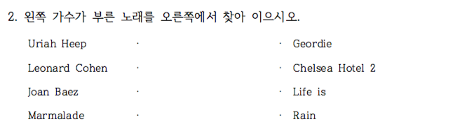

<!--
## Red, Black을 잘못 표시한 사람들

랜덤화출석부에 있는 Red, Black 과 실제 구글예습퀴즈에 올린 Red, Black 이 다른 사람들이 있어서 파악해 보았습니다. 랜덤화 효과는 여기서도 작동하고 있는 걸 알 수 있습니다. Red를 Black 이라고 한 사람의 수효(8명)과 Black을 Red 라고 한 사람의 수효(7명)이 비슷합니다 group 을 잘못 기억하고 있는 사람들의 수효조차 Red, Black 에 비슷하게 나뉘었습니다. 굳이 학번까지 올린 이유는 그 다음 구글예습퀴즈부터라도 제대로 올려주길 바라서입니다.


-->


# 퀴즈 응답

## Birthday Problem

<!--
### 생일이 같은 사람


----------------------------
      학번       생일   그룹
---------- ---------- ------
  20193231   09월19일    Red

  20193249   09월19일    Red
----------------------------
-->

### 어느 날에 몇 명씩 생일이 같은가?


-------------- ---
**09월19일**     2

**계**           2
-------------- ---

### 생일이 같은 날은 모두 며칠인가?


```
## [1] 1
```

### 생일이 같은 사람은 몇 명 정도 기대되는가?


$N$을 전체 인원이라 할 때, 기대 인원은 $N\times\{1- (\frac{364}{365})^{N-1}\}$, 
분산은 $N\times\{1- (\frac{364}{365})^{N-1}\} + N\times(N-1)\times\{1-(\frac{363}{365})^{N-2}\}$로 계산됩니다.

무응답이거나 결석한 학생을 제외한 응답 인원 37명에 대하여 기대인원을 계산하면 3.5명,
표준오차는 1.9명으로 계산되어 관찰된 값이 그 범위에 잘 들어감을 알 수 있습니다.

#### 기대되는 인원


```
## [1] 3.5
```

#### 표준오차


```
## [1] 1.9
```

### 태어난 달의 분포는?


|      | 1월| 2월| 3월| 4월| 5월| 6월| 7월| 8월| 9월| 10월| 11월| 12월| 계|
|:-----|---:|---:|---:|---:|---:|---:|---:|---:|---:|----:|----:|----:|--:|
|Red   |   2|   1|   0|   2|   2|   4|   1|   0|   4|    2|    0|    3| 21|
|Black |   2|   2|   1|   0|   3|   3|   1|   0|   1|    0|    0|    3| 16|
|계    |   4|   3|   1|   2|   5|   7|   2|   0|   5|    2|    0|    6| 37|

#### 랜덤화 효과 


-------------------------------
  Test statistic   df   P value
---------------- ---- ---------
           6.927   NA    0.7451
-------------------------------

Table: Pearson's Chi-squared test with simulated p-value
	 (based on 2000 replicates): `.`

#### 월별로 고르게 출생하였는가?


```
## Warning in chisq.test(., simulate.p.value = FALSE): Chi-squared approximation may be incorrect
```


-------------------------------
  Test statistic   df   P value
---------------- ---- ---------
           9.757    9    0.3705
-------------------------------

Table: Chi-squared test for given probabilities: `.`

## Matching Problem



### 정답갯수의 분포


|      | 0개| 1개| 2개| 4개| 계|
|:-----|---:|---:|---:|---:|--:|
|Red   |   5|  11|   3|   2| 21|
|Black |   4|   8|   3|   1| 16|
|계    |   9|  19|   6|   3| 37|

### Observed vs Expected

랜덤하게 골랐다면, 각각의 확률은 9/24, 8/24, 6/24, 1/24임. 응답인원 37명을 각 확률에 곱해보면 이론적으로 기대되는 인원이 계산됩니다. 확률분포로부터 기대하는 값과 관찰된 값이 벗어나는 것을 관찰할 수 있습니다. 인터넷 검색금지를 일부만 지킨 것 같습니다. 지지난 학기와 비교해 보십시요.
한 가지, 기대값과 표준편차가 다 1이라고 해서 1개 맞추는 사람들이 가장 많은 게 아닙니다.


|           | 0개  | 1개  | 2개  | 4개 |  계  |
|:----------|:----:|:----:|:----:|:---:|:----:|
|Observed   | 9.0  | 19.0 | 6.0  | 3.0 | 37.0 |
|Expected   | 13.9 | 12.3 | 9.2  | 1.5 | 37.0 |
|Difference | -4.9 | 6.7  | -3.2 | 1.5 | 0.0  |

### 카이제곱 테스트


```
## Warning in chisq.test(., p = c(9, 8, 6, 1)/24, simulate.p.value = FALSE): Chi-squared approximation may be incorrect
```


---------------------------------
  Test statistic   df     P value
---------------- ---- -----------
           7.838    3   0.04948 *
---------------------------------

Table: Chi-squared test for given probabilities: `.`

## 직관과 어긋나는 용어

### 연비


1,200 킬로미터룰 주행한다고 해 봅시다. '가'는 120리터에서 100리터로 20리터를 절감하고, '나'는 40리터에서 30리터 10리터를 절감하게 됩니다. 따라서 '가'운전자가 이전보다 더 절감합니다. 연비라는 용어가 주는 직관과는 잘 맞지 않다는 것을 여러분의 응답에서 잘 알 수 있습니다. 연비 높은 차량으로 바꾸는 것이 더 절감할 것이라는 응답이 무려 60%에 가깝습니다. 악마는 디테일에 있습니다. 

### 집계


|      | 연비 10 => 12| 연비 30 => 40| 계|
|:-----|-------------:|-------------:|--:|
|Red   |             3|            18| 21|
|Black |             7|             9| 16|
|계    |            10|            27| 37|


-------------------------------
  Test statistic   df   P value
---------------- ---- ---------
          0.6757   NA     0.512
-------------------------------

Table: Chi-squared test for given probabilities with simulated p-value
	 (based on 20000 replicates): `.`

### % 비교.  


| 연비 10 => 12 | 연비 30 => 40 |  계   |
|:-------------:|:-------------:|:-----:|
|     27.0      |     73.0      | 100.0 |

# Monty Hall 문제

## 문항 배열 효과?

### Red


### Black


염소가 들어있는 문을 보여줌으로써 다른 문에 자동차가 들어 있을 확률은 2/3로 늘어나므로 바꾸는 것이 적절한 판단임. Red와 Black의 차이는 "바꾼다"와 "고수한다"의 순서를 바꾼 것으로 "바꾼다"를 앞에 놓은 Black 집단에서 바꾼다는 응답이 다소 높게 나왔으나 통계적으로 유의한 수준은 아님.

### 집계


------------------------------------
&nbsp;        고수한다   바꾼다   계
----------- ---------- -------- ----
**Red**              9       12   21

**Black**            6       10   16

**계**              15       22   37
------------------------------------


-------------------------------
  Test statistic   df   P value
---------------- ---- ---------
       1.216e-31    1         1
-------------------------------

Table: Pearson's Chi-squared test with Yates' continuity correction: `.`

### % 비교.  


---------------------------------------
&nbsp;        고수한다   바꾼다      계
----------- ---------- -------- -------
**Red**           42.9     57.1   100.0

**Black**         37.5     62.5   100.0
---------------------------------------

### 합산(%)


------------------------------------
&nbsp;     고수한다   바꾼다      계
-------- ---------- -------- -------
**계**         40.5     59.5   100.0
------------------------------------


