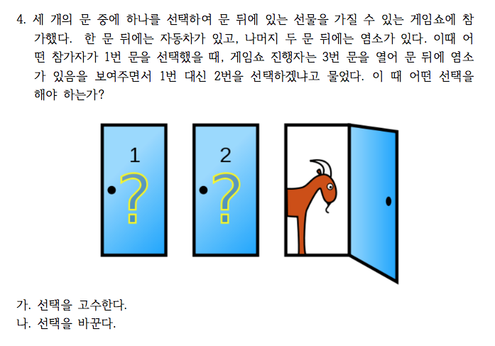

<!--
## Red, Black을 잘못 표시한 사람들

랜덤화출석부에 있는 Red, Black 과 실제 구글예습퀴즈에 올린 Red, Black 이 다른 사람들이 있어서 파악해 보았습니다. 랜덤화 효과는 여기서도 작동하고 있는 걸 알 수 있습니다. Red를 Black 이라고 한 사람의 수효(8명)과 Black을 Red 라고 한 사람의 수효(7명)이 비슷합니다 group 을 잘못 기억하고 있는 사람들의 수효조차 Red, Black 에 비슷하게 나뉘었습니다. 굳이 학번까지 올린 이유는 그 다음 구글예습퀴즈부터라도 제대로 올려주길 바라서입니다.


-->


# 퀴즈 응답

## Birthday Problem

<!--
### 생일이 같은 사람


-----------------------------
      학번       생일    그룹
---------- ---------- -------
  20162867   01월01일   Black

  20181094   01월01일   Black

  20181728   01월01일   Black

  20192915   01월01일     Red

  20213016   01월01일     Red

  20203012   01월03일   Black

  20226171   01월03일   Black

  20201724   01월04일     Red

  20202904   01월04일     Red

  20216116   01월04일   Black

  20212605   01월05일   Black

  20212979   01월05일     Red

  20226106   01월05일   Black

  20193405   01월06일     Red

  20216523   01월06일     Red

  20175229   01월08일   Black

  20211719   01월08일   Black

  20212109   01월08일     Red

  20176513   01월09일   Black

  20212131   01월09일   Black

  20216707   01월09일   Black

  20223231   01월09일   Black

  20185427   01월11일     Red

  20212333   01월11일   Black

  20191221   01월13일   Black

  20203044   01월13일     Red

  20211507   01월13일   Black

  20211611   01월14일     Red

  20213701   01월14일     Red

  20221033   01월14일     Red

  20182879   01월15일     Red

  20183509   01월15일     Red

  20193019   01월15일     Red

  20193944   01월15일     Red

  20207139   01월15일     Red

  20212540   01월15일   Black

  20212841   01월15일     Red

  20213318   01월15일   Black

  20214133   01월15일   Black

  20223602   01월15일   Black

  20181206   01월16일     Red

  20223213   01월16일   Black

  20191105   01월17일   Black

  20193334   01월17일   Black

  20215208   01월17일     Red

  20171542   01월18일     Red

  20201549   01월18일   Black

  20222227   01월18일     Red

  20182809   01월19일   Black

  20192559   01월19일     Red

  20198015   01월19일     Red

  20196632   01월22일     Red

  20203255   01월22일     Red

  20131126   01월24일     Red

  20211203   01월24일   Black

  20226756   01월24일     Red

  20175219   01월25일   Black

  20204134   01월25일   Black

  20162759   01월26일     Red

  20172617   01월26일     Red

  20212970   01월26일     Red

  20216404   01월26일     Red

  20102935   01월27일     Red

  20198107   01월27일     Red

  20211534   01월27일   Black

  20176528   01월30일     Red

  20215153   01월30일   Black

  20222127   01월30일     Red

  20223706   01월30일     Red

  20175416   02월01일     Red

  20185175   02월01일   Black

  20193214   02월01일   Black

  20207062   02월01일   Black

  20212908   02월01일   Black

  20216105   02월02일     Red

  20216141   02월02일     Red

  20211716   02월04일     Red

  20222348   02월04일   Black

  20196614   02월05일   Black

  20201522   02월05일     Red

  20212328   02월05일   Black

  20173121   02월07일   Black

  20203920   02월07일     Red

  20225162   02월07일   Black

  20226151   02월07일   Black

  20226270   02월07일   Black

  20226619   02월07일     Red

  20181732   02월09일   Black

  20196601   02월09일   Black

  20225269   02월09일   Black

  20175155   02월11일   Black

  20182719   02월11일   Black

  20206250   02월11일     Red

  20216226   02월11일     Red

  20216292   02월11일     Red

  20193642   02월13일   Black

  20212361   02월13일   Black

  20172350   02월18일     Red

  20186530   02월18일   Black

  20212916   02월18일   Black

  20162401   02월19일     Red

  20212943   02월19일     Red

  20213057   02월19일     Red

  20213057   02월19일     Red

  20216647   02월19일     Red

  20225246   02월19일     Red

  20203967   02월23일   Black

  20223228   02월23일   Black

  20193607   02월25일     Red

  20201202   02월25일   Black

  20181078   02월27일     Red

  20181718   02월27일     Red

  20185129   02월27일   Black

  20222129   02월27일   Black

  20163514   02월28일   Black

  20192825   02월28일     Red

  20193734   03월01일     Red

  20202639   03월01일     Red

  20212816   03월01일     Red

  20216505   03월01일     Red

  20173723   03월02일   Black

  20192550   03월02일     Red

  20207123   03월02일     Red

  20216227   03월02일     Red

  20155122   03월05일   Black

  20183958   03월05일   Black

  20213716   03월05일   Black

  20188008   03월06일   Black

  20203953   03월06일   Black

  20226157   03월06일   Black

  20173508   03월07일   Black

  20192856   03월07일     Red

  20196428   03월07일   Black

  20155254   03월08일     Red

  20175101   03월08일   Black

  20211505   03월08일     Red

  20212833   03월08일   Black

  20213229   03월08일     Red

  20213920   03월08일   Black

  20215227   03월08일   Black

  20216134   03월08일   Black

  20181510   03월09일     Red

  20207146   03월09일   Black

  20193643   03월10일   Black

  20223203   03월10일   Black

  20223908   03월10일     Red

  20212558   03월11일   Black

  20222133   03월11일   Black

  20226126   03월11일   Black

  20193614   03월13일     Red

  20201236   03월13일   Black

  20212917   03월13일     Red

  20213735   03월13일     Red

  20225240   03월13일   Black

  20196631   03월14일     Red

  20203054   03월14일     Red

  20216504   03월14일   Black

  20212716   03월15일     Red

  20216217   03월15일   Black

  20226101   03월15일   Black

  20226161   03월15일     Red

  20172848   03월16일   Black

  20181640   03월16일     Red

  20212616   03월16일   Black

  20213517   03월16일     Red

  20215169   03월16일     Red

  20172574   03월17일     Red

  20182363   03월17일     Red

  20192811   03월17일   Black

  20181525   03월19일   Black

  20191215   03월19일     Red

  20192537   03월19일   Black

  20213516   03월19일   Black

  20192883   03월20일   Black

  20195276   03월20일     Red

  20193543   03월21일     Red

  20212631   03월21일   Black

  20212998   03월21일   Black

  20181531   03월24일     Red

  20204139   03월24일   Black

  20216419   03월24일   Black

  20175333   03월25일     Red

  20216703   03월25일   Black

  20223245   03월25일     Red

  20195267   03월26일   Black

  20212614   03월26일     Red

  20213613   03월26일   Black

  20222363   03월26일   Black

  20202230   03월27일     Red

  20202567   03월27일     Red

  20212904   03월27일     Red

  20178056   03월28일   Black

  20183203   03월28일     Red

  20192612   03월28일     Red

  20185104   03월29일   Black

  20213937   03월29일   Black

  20216244   03월29일     Red

  20211222   03월30일     Red

  20226156   03월30일     Red

  20175417   03월31일     Red

  20193257   03월31일   Black

  20193941   03월31일     Red

  20193206   04월02일   Black

  20196509   04월02일   Black

  20202998   04월02일   Black

  20207076   04월04일   Black

  20216303   04월04일     Red

  20211095   04월05일   Black

  20213504   04월05일     Red

  20171240   04월09일   Black

  20183313   04월09일   Black

  20226144   04월09일   Black

  20226705   04월09일     Red

  20163027   04월10일   Black

  20183728   04월10일   Black

  20221514   04월10일   Black

  20172871   04월11일     Red

  20213416   04월11일   Black

  20213603   04월12일     Red

  20213643   04월12일   Black

  20182206   04월13일     Red

  20182355   04월13일     Red

  20196644   04월13일     Red

  20202439   04월13일   Black

  20192710   04월14일   Black

  20211602   04월14일   Black

  20172121   04월15일   Black

  20212637   04월15일     Red

  20182865   04월18일   Black

  20193304   04월18일     Red

  20213524   04월18일   Black

  20223230   04월18일     Red

  20175402   04월19일   Black

  20215256   04월19일     Red

  20223202   04월19일     Red

  20225125   04월19일     Red

  20226768   04월19일     Red

  20182980   04월20일   Black

  20212639   04월20일   Black

  20226140   04월20일     Red

  20182357   04월23일   Black

  20192431   04월23일   Black

  20205112   04월23일   Black

  20212509   04월23일     Red

  20213525   04월23일   Black

  20213704   04월23일     Red

  20197033   04월25일   Black

  20212410   04월25일   Black

  20213846   04월25일     Red

  20223822   04월25일   Black

  20225236   04월25일     Red

  20182731   04월26일     Red

  20216423   04월26일   Black

  20192973   04월27일     Red

  20201105   04월27일     Red

  20216260   04월29일     Red

  20226747   04월29일     Red

  20172759   04월30일     Red

  20193704   04월30일   Black

  20213007   04월30일   Black

  20175401   05월01일   Black

  20202427   05월01일   Black

  20226729   05월01일   Black

  20226786   05월01일   Black

  20213429   05월02일     Red

  20222333   05월02일     Red

  20213334   05월04일     Red

  20216715   05월04일     Red

  20193318   05월05일   Black

  20221031   05월05일   Black

  20165435   05월06일   Black

  20195229   05월06일     Red

  20203419   05월06일   Black

  20175143   05월07일     Red

  20182548   05월07일     Red

  20203935   05월07일   Black

  20213048   05월07일   Black

  20182433   05월08일     Red

  20195219   05월08일     Red

  20196409   05월08일     Red

  20206173   05월08일   Black

  20211017   05월08일     Red

  20211513   05월08일   Black

  20211524   05월08일     Red

  20225223   05월08일   Black

  20182975   05월09일   Black

  20195114   05월09일     Red

  20212907   05월09일   Black

  20216516   05월09일     Red

  20162523   05월11일   Black

  20183902   05월11일   Black

  20173129   05월13일     Red

  20175168   05월13일   Black

  20193948   05월13일   Black

  20211090   05월13일     Red

  20212140   05월13일   Black

  20176425   05월14일   Black

  20202928   05월14일   Black

  20205110   05월14일     Red

  20198059   05월16일     Red

  20216206   05월16일   Black

  20216648   05월16일   Black

  20216741   05월17일     Red

  20221719   05월17일     Red

  20154309   05월18일     Red

  20188056   05월18일   Black

  20192533   05월18일     Red

  20224153   05월18일   Black

  20173208   05월21일     Red

  20191235   05월21일     Red

  20212720   05월21일   Black

  20162613   05월23일   Black

  20162615   05월23일     Red

  20201518   05월23일     Red

  20165218   05월25일   Black

  20213933   05월25일     Red

  20171044   05월26일   Black

  20222417   05월26일     Red

  20223408   05월26일     Red

  20203941   05월28일     Red

  20206419   05월28일     Red

  20185261   05월30일     Red

  20202222   05월30일     Red

  20172130   05월31일   Black

  20203940   05월31일     Red

  20224131   05월31일     Red

  20185209   06월01일   Black

  20196624   06월01일   Black

  20216167   06월01일   Black

  20226114   06월01일   Black

  20185232   06월05일     Red

  20211035   06월05일     Red

  20213715   06월05일   Black

  20213715   06월05일   Black

  20226134   06월05일     Red

  20173740   06월07일     Red

  20212569   06월07일   Black

  20213917   06월07일   Black

  20216422   06월07일   Black

  20163414   06월09일     Red

  20171724   06월09일     Red

  20182315   06월09일   Black

  20192812   06월09일   Black

  20212128   06월09일   Black

  20212429   06월09일     Red

  20216253   06월09일   Black

  20182579   06월10일   Black

  20202532   06월10일   Black

  20211530   06월10일   Black

  20193339   06월12일     Red

  20213513   06월12일   Black

  20175144   06월20일   Black

  20192410   06월20일     Red

  20211224   06월21일   Black

  20226172   06월21일     Red

  20182859   06월22일     Red

  20215113   06월22일     Red

  20183937   06월24일   Black

  20197082   06월24일   Black

  20216224   06월24일   Black

  20213419   06월26일     Red

  20226164   06월26일     Red

  20185204   06월27일   Black

  20202605   06월27일   Black

  20203933   06월27일   Black

  20192320   06월28일     Red

  20212993   06월28일   Black

  20223957   06월28일     Red

  20175247   06월29일   Black

  20216147   06월29일     Red

  20182828   07월01일   Black

  20213046   07월01일     Red

  20152576   07월03일   Black

  20181524   07월03일   Black

  20202821   07월05일     Red

  20222757   07월05일     Red

  20223838   07월05일     Red

  20205279   07월06일   Black

  20212353   07월06일     Red

  20192759   07월08일   Black

  20203905   07월08일   Black

  20226131   07월08일     Red

  20201536   07월10일   Black

  20213034   07월10일   Black

  20216512   07월10일     Red

  20185141   07월11일     Red

  20195243   07월11일     Red

  20211088   07월11일     Red

  20212627   07월11일     Red

  20183940   07월12일     Red

  20198047   07월12일   Black

  20202715   07월12일   Black

  20223827   07월12일   Black

  20181532   07월13일   Black

  20183929   07월13일     Red

  20195232   07월13일   Black

  20212572   07월13일     Red

  20175226   07월14일     Red

  20183208   07월14일     Red

  20192748   07월19일   Black

  20216530   07월19일     Red

  20211729   07월20일     Red

  20226635   07월20일     Red

  20195271   07월22일   Black

  20223257   07월22일   Black

  20165528   07월23일     Red

  20172611   07월23일     Red

  20223632   07월24일   Black

  20223925   07월24일     Red

  20212909   07월25일     Red

  20216295   07월25일   Black

  20223015   07월25일     Red

  20211518   07월26일     Red

  20212906   07월26일     Red

  20213001   07월26일     Red

  20185156   07월30일     Red

  20193954   07월30일   Black

  20203724   07월30일   Black

  20213003   07월30일   Black

  20226123   07월30일     Red

  20212713   07월31일     Red

  20216221   07월31일   Black

  20216293   07월31일   Black

  20223629   07월31일     Red

  20208003   08월01일     Red

  20212640   08월01일   Black

  20185205   08월02일     Red

  20192866   08월02일   Black

  20183248   08월03일     Red

  20226138   08월03일     Red

  20188050   08월06일     Red

  20195263   08월06일     Red

  20212513   08월06일   Black

  20195282   08월07일   Black

  20211607   08월07일   Black

  20183939   08월09일     Red

  20192424   08월09일   Black

  20216107   08월09일     Red

  20226105   08월09일   Black

  20181535   08월10일     Red

  20198044   08월10일     Red

  20212817   08월10일     Red

  20222408   08월11일   Black

  20222998   08월11일   Black

  20198047   08월12일   Black

  20202506   08월12일     Red

  20171048   08월15일   Black

  20192368   08월15일   Black

  20183004   08월16일     Red

  20202505   08월16일     Red

  20213926   08월16일     Red

  20226150   08월16일   Black

  20211521   08월17일     Red

  20216417   08월17일   Black

  20152202   08월20일     Red

  20188052   08월20일   Black

  20212938   08월20일   Black

  20193537   08월21일     Red

  20212515   08월21일     Red

  20193953   08월22일   Black

  20201211   08월22일   Black

  20212903   08월22일   Black

  20213418   08월22일     Red

  20226641   08월22일   Black

  20192538   08월23일     Red

  20212427   08월23일     Red

  20211615   08월27일   Black

  20213029   08월27일   Black

  20223247   08월27일   Black

  20223413   08월27일   Black

  20181223   08월28일   Black

  20185271   08월28일     Red

  20213322   08월28일   Black

  20192541   08월30일   Black

  20193411   08월30일   Black

  20216287   08월30일   Black

  20216502   08월30일   Black

  20191724   08월31일   Black

  20193306   08월31일   Black

  20162804   09월01일   Black

  20172708   09월01일     Red

  20175218   09월03일     Red

  20185428   09월03일   Black

  20203427   09월03일   Black

  20211240   09월03일     Red

  20191051   09월04일   Black

  20223229   09월04일   Black

  20195223   09월05일   Black

  20223620   09월05일   Black

  20182632   09월06일     Red

  20195192   09월06일   Black

  20205109   09월06일     Red

  20212706   09월06일     Red

  20162526   09월08일     Red

  20185290   09월08일   Black

  20202436   09월08일   Black

  20182836   09월09일   Black

  20183532   09월09일   Black

  20212962   09월09일     Red

  20182890   09월10일     Red

  20196612   09월10일   Black

  20215206   09월10일   Black

  20195113   09월11일     Red

  20212502   09월11일     Red

  20172906   09월12일     Red

  20211613   09월12일   Black

  20203243   09월15일     Red

  20213914   09월15일     Red

  20216139   09월15일     Red

  20175140   09월16일   Black

  20213532   09월16일   Black

  20213718   09월16일   Black

  20226136   09월16일     Red

  20226609   09월16일     Red

  20182585   09월17일     Red

  20203943   09월17일     Red

  20212953   09월17일   Black

  20153159   09월18일     Red

  20183322   09월18일   Black

  20213037   09월18일   Black

  20223811   09월18일     Red

  20193249   09월19일     Red

  20225118   09월19일     Red

  20226130   09월19일   Black

  20185249   09월20일     Red

  20216208   09월20일     Red

  20163024   09월21일   Black

  20191632   09월21일   Black

  20201703   09월21일   Black

  20213410   09월21일     Red

  20212345   09월23일   Black

  20213935   09월23일   Black

  20216212   09월23일     Red

  20151501   09월24일   Black

  20203403   09월24일   Black

  20212807   09월24일     Red

  20163618   09월26일   Black

  20172206   09월26일     Red

  20182885   09월26일   Black

  20203650   09월26일   Black

  20211636   09월26일   Black

  20171066   09월28일     Red

  20181006   09월28일     Red

  20182841   09월28일     Red

  20213053   09월28일     Red

  20173605   09월29일     Red

  20201208   09월29일   Black

  20202955   09월29일   Black

  20172565   09월30일   Black

  20182337   09월30일   Black

  20195119   09월30일     Red

  20162811   10월01일   Black

  20182349   10월01일     Red

  20212835   10월01일     Red

  20223630   10월01일   Black

  20182839   10월02일   Black

  20185234   10월02일     Red

  20195214   10월02일   Black

  20226141   10월02일     Red

  20201222   10월03일     Red

  20212120   10월03일     Red

  20223635   10월03일     Red

  20182512   10월05일   Black

  20185237   10월05일     Red

  20216207   10월05일     Red

  20226112   10월05일     Red

  20185274   10월06일     Red

  20196623   10월06일   Black

  20216249   10월06일     Red

  20135177   10월07일     Red

  20216204   10월07일   Black

  20171734   10월08일   Black

  20201512   10월08일     Red

  20202133   10월08일   Black

  20211217   10월08일   Black

  20216243   10월08일     Red

  20223340   10월08일     Red

  20182964   10월11일     Red

  20211533   10월11일     Red

  20183012   10월12일     Red

  20195178   10월12일     Red

  20195178   10월12일     Red

  20195197   10월12일     Red

  20212344   10월12일     Red

  20172129   10월13일   Black

  20173655   10월13일   Black

  20222403   10월13일     Red

  20226174   10월13일   Black

  20176516   10월14일   Black

  20182832   10월14일   Black

  20213005   10월14일   Black

  20204144   10월16일   Black

  20213009   10월16일     Red

  20226723   10월16일   Black

  20192563   10월17일   Black

  20193623   10월17일     Red

  20181240   10월18일     Red

  20211628   10월18일   Black

  20192123   10월20일   Black

  20192707   10월20일     Red

  20202429   10월20일   Black

  20201235   10월22일   Black

  20225176   10월22일   Black

  20162633   10월24일     Red

  20192534   10월24일   Black

  20222854   10월24일     Red

  20175123   10월27일   Black

  20175133   10월27일     Red

  20193264   10월27일     Red

  20223204   10월27일   Black

  20196417   10월28일   Black

  20196619   10월28일   Black

  20215231   10월28일   Black

  20202550   10월31일     Red

  20213610   10월31일     Red

  20225180   10월31일   Black

  20192558   11월01일     Red

  20211710   11월01일     Red

  20175164   11월02일   Black

  20192117   11월02일   Black

  20165141   11월03일     Red

  20223946   11월03일     Red

  20175157   11월05일     Red

  20226785   11월05일     Red

  20195228   11월06일     Red

  20202626   11월06일     Red

  20211045   11월06일     Red

  20212577   11월06일     Red

  20213923   11월07일     Red

  20216307   11월07일     Red

  20216708   11월07일     Red

  20183539   11월08일   Black

  20222568   11월08일   Black

  20181502   11월11일   Black

  20195274   11월11일     Red

  20223724   11월11일   Black

  20162701   11월13일     Red

  20182734   11월13일     Red

  20213027   11월13일   Black

  20213404   11월13일     Red

  20206641   11월14일   Black

  20212305   11월14일   Black

  20216118   11월14일   Black

  20222635   11월14일     Red

  20196414   11월16일     Red

  20202534   11월16일     Red

  20212326   11월16일   Black

  20223603   11월16일   Black

  20182570   11월21일   Black

  20201704   11월21일   Black

  20206621   11월21일     Red

  20213734   11월21일   Black

  20201203   11월22일     Red

  20205138   11월22일     Red

  20192509   11월23일   Black

  20202625   11월23일     Red

  20216222   11월23일     Red

  20175102   11월25일     Red

  20192313   11월25일   Black

  20201516   11월25일   Black

  20225195   11월25일     Red

  20182910   11월26일     Red

  20188043   11월26일   Black

  20185260   11월27일   Black

  20192997   11월27일     Red

  20196518   11월27일     Red

  20211717   11월27일     Red

  20182366   11월29일     Red

  20193648   11월29일   Black

  20207081   11월29일     Red

  20191018   11월30일     Red

  20213810   11월30일     Red

  20183224   12월03일     Red

  20183526   12월03일     Red

  20213640   12월03일   Black

  20221520   12월03일     Red

  20182441   12월04일   Black

  20182848   12월04일   Black

  20222931   12월04일     Red

  20165527   12월06일   Black

  20226148   12월06일     Red

  20192640   12월07일     Red

  20193702   12월07일   Black

  20185158   12월09일   Black

  20213705   12월09일   Black

  20191049   12월10일   Black

  20192202   12월10일     Red

  20193937   12월10일   Black

  20203313   12월10일     Red

  20201502   12월12일   Black

  20203417   12월12일     Red

  20165144   12월13일     Red

  20183949   12월13일   Black

  20203645   12월13일   Black

  20203402   12월16일   Black

  20212963   12월16일     Red

  20223971   12월16일     Red

  20162910   12월18일     Red

  20175303   12월18일   Black

  20215265   12월18일   Black

  20216113   12월18일     Red

  20131731   12월19일   Black

  20191212   12월19일     Red

  20207023   12월19일     Red

  20176520   12월20일     Red

  20202726   12월20일   Black

  20175434   12월23일   Black

  20192895   12월23일     Red

  20213025   12월23일     Red

  20213945   12월23일     Red

  20215247   12월23일   Black

  20216612   12월23일   Black

  20175132   12월25일     Red

  20192627   12월25일   Black

  20198050   12월25일   Black

  20213508   12월25일     Red

  20192314   12월27일     Red

  20211514   12월27일   Black

  20155153   12월29일     Red

  20182913   12월29일     Red

  20213824   12월29일     Red

  20191046   12월30일     Red

  20192894   12월30일   Black

  20223846   12월30일   Black

  20182969   12월31일     Red

  20225134   12월31일   Black
-----------------------------
-->

### 어느 날에 몇 명씩 생일이 같은가?


-------------- -----
**01월01일**       5

**01월03일**       2

**01월04일**       3

**01월05일**       3

**01월06일**       2

**01월08일**       3

**01월09일**       4

**01월11일**       2

**01월13일**       3

**01월14일**       3

**01월15일**      10

**01월16일**       2

**01월17일**       3

**01월18일**       3

**01월19일**       3

**01월22일**       2

**01월24일**       3

**01월25일**       2

**01월26일**       4

**01월27일**       3

**01월30일**       4

**02월01일**       5

**02월02일**       2

**02월04일**       2

**02월05일**       3

**02월07일**       6

**02월09일**       3

**02월11일**       5

**02월13일**       2

**02월18일**       3

**02월19일**       6

**02월23일**       2

**02월25일**       2

**02월27일**       4

**02월28일**       2

**03월01일**       4

**03월02일**       4

**03월05일**       3

**03월06일**       3

**03월07일**       3

**03월08일**       8

**03월09일**       2

**03월10일**       3

**03월11일**       3

**03월13일**       5

**03월14일**       3

**03월15일**       4

**03월16일**       5

**03월17일**       3

**03월19일**       4

**03월20일**       2

**03월21일**       3

**03월24일**       3

**03월25일**       3

**03월26일**       4

**03월27일**       3

**03월28일**       3

**03월29일**       3

**03월30일**       2

**03월31일**       3

**04월02일**       3

**04월04일**       2

**04월05일**       2

**04월09일**       4

**04월10일**       3

**04월11일**       2

**04월12일**       2

**04월13일**       4

**04월14일**       2

**04월15일**       2

**04월18일**       4

**04월19일**       5

**04월20일**       3

**04월23일**       6

**04월25일**       5

**04월26일**       2

**04월27일**       2

**04월29일**       2

**04월30일**       3

**05월01일**       4

**05월02일**       2

**05월04일**       2

**05월05일**       2

**05월06일**       3

**05월07일**       4

**05월08일**       8

**05월09일**       4

**05월11일**       2

**05월13일**       5

**05월14일**       3

**05월16일**       3

**05월17일**       2

**05월18일**       4

**05월21일**       3

**05월23일**       3

**05월25일**       2

**05월26일**       3

**05월28일**       2

**05월30일**       2

**05월31일**       3

**06월01일**       4

**06월05일**       5

**06월07일**       4

**06월09일**       7

**06월10일**       3

**06월12일**       2

**06월20일**       2

**06월21일**       2

**06월22일**       2

**06월24일**       3

**06월26일**       2

**06월27일**       3

**06월28일**       3

**06월29일**       2

**07월01일**       2

**07월03일**       2

**07월05일**       3

**07월06일**       2

**07월08일**       3

**07월10일**       3

**07월11일**       4

**07월12일**       4

**07월13일**       4

**07월14일**       2

**07월19일**       2

**07월20일**       2

**07월22일**       2

**07월23일**       2

**07월24일**       2

**07월25일**       3

**07월26일**       3

**07월30일**       5

**07월31일**       4

**08월01일**       2

**08월02일**       2

**08월03일**       2

**08월06일**       3

**08월07일**       2

**08월09일**       4

**08월10일**       3

**08월11일**       2

**08월12일**       2

**08월15일**       2

**08월16일**       4

**08월17일**       2

**08월20일**       3

**08월21일**       2

**08월22일**       5

**08월23일**       2

**08월27일**       4

**08월28일**       3

**08월30일**       4

**08월31일**       2

**09월01일**       2

**09월03일**       4

**09월04일**       2

**09월05일**       2

**09월06일**       4

**09월08일**       3

**09월09일**       3

**09월10일**       3

**09월11일**       2

**09월12일**       2

**09월15일**       3

**09월16일**       5

**09월17일**       3

**09월18일**       4

**09월19일**       3

**09월20일**       2

**09월21일**       4

**09월23일**       3

**09월24일**       3

**09월26일**       5

**09월28일**       4

**09월29일**       3

**09월30일**       3

**10월01일**       4

**10월02일**       4

**10월03일**       3

**10월05일**       4

**10월06일**       3

**10월07일**       2

**10월08일**       6

**10월11일**       2

**10월12일**       5

**10월13일**       4

**10월14일**       3

**10월16일**       3

**10월17일**       2

**10월18일**       2

**10월20일**       3

**10월22일**       2

**10월24일**       3

**10월27일**       4

**10월28일**       3

**10월31일**       3

**11월01일**       2

**11월02일**       2

**11월03일**       2

**11월05일**       2

**11월06일**       4

**11월07일**       3

**11월08일**       2

**11월11일**       3

**11월13일**       4

**11월14일**       4

**11월16일**       4

**11월21일**       4

**11월22일**       2

**11월23일**       3

**11월25일**       4

**11월26일**       2

**11월27일**       4

**11월29일**       3

**11월30일**       2

**12월03일**       4

**12월04일**       3

**12월06일**       2

**12월07일**       2

**12월09일**       2

**12월10일**       4

**12월12일**       2

**12월13일**       3

**12월16일**       3

**12월18일**       4

**12월19일**       3

**12월20일**       2

**12월23일**       6

**12월25일**       4

**12월27일**       2

**12월29일**       3

**12월30일**       3

**12월31일**       2

**계**           726
-------------- -----

### 생일이 같은 날은 모두 며칠인가?


```
## [1] 233
```

### 생일이 같은 사람은 몇 명 정도 기대되는가?


$N$을 전체 인원이라 할 때, 기대 인원은 $N\times\{1- (\frac{364}{365})^{N-1}\}$, 
분산은 $N\times\{1- (\frac{364}{365})^{N-1}\} + N\times(N-1)\times\{1-(\frac{363}{365})^{N-2}\}$로 계산됩니다.

무응답이거나 결석한 학생을 제외한 응답 인원 820명에 대하여 기대인원을 계산하면 733.3명,
표준오차는 27.1명으로 계산되어 관찰된 값이 그 범위에 잘 들어감을 알 수 있습니다.

#### 기대되는 인원


```
## [1] 733.3
```

#### 표준오차


```
## [1] 27.1
```

### 태어난 달의 분포는?


|      | 1월| 2월| 3월| 4월| 5월| 6월| 7월| 8월| 9월| 10월| 11월| 12월|  계|
|:-----|---:|---:|---:|---:|---:|---:|---:|---:|---:|----:|----:|----:|---:|
|Red   |  42|  25|  44|  29|  38|  24|  37|  30|  37|   36|   38|   35| 415|
|Black |  35|  31|  46|  35|  35|  33|  27|  33|  40|   35|   26|   29| 405|
|계    |  77|  56|  90|  64|  73|  57|  64|  63|  77|   71|   64|   64| 820|

#### 랜덤화 효과 


-------------------------------
  Test statistic   df   P value
---------------- ---- ---------
           7.959   NA    0.7141
-------------------------------

Table: Pearson's Chi-squared test with simulated p-value
	 (based on 2000 replicates): `.`

#### 월별로 고르게 출생하였는가?


-------------------------------
  Test statistic   df   P value
---------------- ---- ---------
           15.11   11    0.1774
-------------------------------

Table: Chi-squared test for given probabilities: `.`

## Matching Problem


### 정답갯수의 분포


|      | 0개| 1개| 2개| 4개|  계|
|:-----|---:|---:|---:|---:|---:|
|Red   | 137| 182|  88|   8| 415|
|Black | 115| 191|  85|  14| 405|
|계    | 252| 373| 173|  22| 820|

### Observed vs Expected

랜덤하게 골랐다면, 각각의 확률은 9/24, 8/24, 6/24, 1/24임. 응답인원 820명을 각 확률에 곱해보면 이론적으로 기대되는 인원이 계산됩니다. 확률분포로부터 기대하는 값과 관찰된 값이 벗어나는 것을 관찰할 수 있습니다. 인터넷 검색금지를 일부만 지킨 것 같습니다. 지지난 학기와 비교해 보십시요.
한 가지, 기대값과 표준편차가 다 1이라고 해서 1개 맞추는 사람들이 가장 많은 게 아닙니다.


|           |  0개  |  1개  |  2개  |  4개  |  계   |
|:----------|:-----:|:-----:|:-----:|:-----:|:-----:|
|Observed   | 252.0 | 373.0 | 173.0 | 22.0  | 820.0 |
|Expected   | 307.5 | 273.3 | 205.0 | 34.2  | 820.0 |
|Difference | -55.5 | 99.7  | -32.0 | -12.2 |  0.0  |

### 카이제곱 테스트


-------------------------------------
  Test statistic   df         P value
---------------- ---- ---------------
           55.69    3   4.9e-12 * * *
-------------------------------------

Table: Chi-squared test for given probabilities: `.`

## 직관과 어긋나는 용어

### 연비


1,200 킬로미터룰 주행한다고 해 봅시다. '가'는 120리터에서 100리터로 20리터를 절감하고, '나'는 40리터에서 30리터 10리터를 절감하게 됩니다. 따라서 '가'운전자가 이전보다 더 절감합니다. 연비라는 용어가 주는 직관과는 잘 맞지 않다는 것을 여러분의 응답에서 잘 알 수 있습니다. 연비 높은 차량으로 바꾸는 것이 더 절감할 것이라는 응답이 무려 60%에 가깝습니다. 악마는 디테일에 있습니다. 

### 집계


|      | 연비 10 => 12| 연비 30 => 40|  계|
|:-----|-------------:|-------------:|---:|
|Red   |           169|           246| 415|
|Black |           147|           258| 405|
|계    |           316|           504| 820|


-------------------------------
  Test statistic   df   P value
---------------- ---- ---------
           0.122   NA    0.7559
-------------------------------

Table: Chi-squared test for given probabilities with simulated p-value
	 (based on 20000 replicates): `.`

### % 비교.  


| 연비 10 => 12 | 연비 30 => 40 |  계   |
|:-------------:|:-------------:|:-----:|
|     38.5      |     61.5      | 100.0 |

# Monty Hall 문제

## 문항 배열 효과?

### Red



### Black


염소가 들어있는 문을 보여줌으로써 다른 문에 자동차가 들어 있을 확률은 2/3로 늘어나므로 바꾸는 것이 적절한 판단임. Red와 Black의 차이는 "바꾼다"와 "고수한다"의 순서를 바꾼 것으로 "바꾼다"를 앞에 놓은 Black 집단에서 바꾼다는 응답이 다소 높게 나왔으나 통계적으로 유의한 수준은 아님.

### 집계


-------------------------------------
&nbsp;        고수한다   바꾼다    계
----------- ---------- -------- -----
**Red**            274      141   415

**Black**          256      149   405

**계**             530      290   820
-------------------------------------


-------------------------------
  Test statistic   df   P value
---------------- ---- ---------
          0.5924    1    0.4415
-------------------------------

Table: Pearson's Chi-squared test with Yates' continuity correction: `.`

### % 비교.  


---------------------------------------
&nbsp;        고수한다   바꾼다      계
----------- ---------- -------- -------
**Red**           66.0     34.0   100.0

**Black**         63.2     36.8   100.0
---------------------------------------

### 합산(%)


------------------------------------
&nbsp;     고수한다   바꾼다      계
-------- ---------- -------- -------
**계**         64.6     35.4   100.0
------------------------------------


